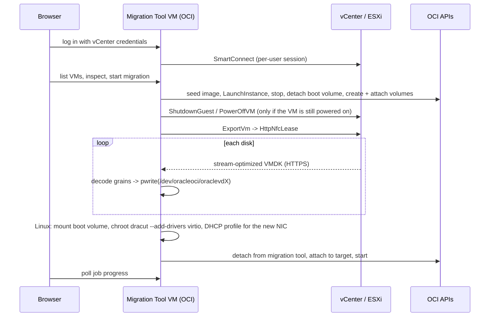

# How the OCI Ultimate Migration Tool works

Technical overview of the OCI Ultimate Migration Tool: the copy mechanism, the supported source endpoints, the
network flows, the repository layout and how to develop on it. For the step-by-step internals see
[architecture.md](architecture.md); for the guest OS / launch option / shape tables see
[os-mapping.md](os-mapping.md); for known limitations and troubleshooting see
[limitations.md](limitations.md); for deployment and configuration see [install-helper.md](install-helper.md).

## Migration mechanism

Migrations run **without VDDK, without an OVA download and without temporary storage**. Everything
runs on a single VM in OCI, the **OCI Migration Tool VM**. You log in to its web UI with your vCenter (or ESXi) credentials,
pick a VM, choose the OCI target and start. The migration tool:

1. registers a tiny *seed* custom image for the VM's firmware (BIOS/UEFI) and operating system
   (reused for later VMs with the same combination), launches the target instance from it with the
   right launch options (boot volume type, NIC type, Windows licensing), stops it and detaches its
   boot volume;
2. creates the data volumes and attaches boot and data volumes to itself;
3. shuts the source VM down if it is still powered on (confirmed by the operator when starting the
   job: guest OS shutdown through VMware Tools, hard power-off as fallback), then opens an `HttpNfcLease` (the mechanism behind *Export OVF*) on vCenter and streams each disk as a
   stream-optimized VMDK straight from vCenter, decoding the compressed grains on the fly and
   `pwrite()`-ing them at their offsets on the attached OCI volumes;
4. for Linux guests, mounts the copied boot volume once and (a) rebuilds the initramfs with virtio
   drivers where it lacks them (guest's own dracut in a chroot; RHEL-family hostonly images otherwise
   cannot find their root disk in OCI) and (b) makes the guest configure its renamed network interface
   with DHCP (NetworkManager profile matching any Ethernet device, first-boot unit for legacy
   network-scripts, netplan/networkd drop-ins; MAC-pinned udev rules disabled) - both steps optional
   under *Advanced: firmware and device model*;
5. detaches the volumes from itself, attaches them to the target instance and starts it.



## Supported source environments

The migration tool talks plain vSphere API (pyVmomi `SmartConnect`) and NFC over HTTPS, so it works with either
management endpoint. The server address is entered on the login page, so one migration tool can serve several
of them.

| Source | Log in as | Notes |
| --- | --- | --- |
| **vCenter Server** (7.0 or later recommended; 6.5/6.7 work) | a vCenter/SSO user, e.g. `user@vsphere.local` or a domain account | Full inventory (folders, all hosts/clusters). Disks are streamed through the vCenter proxy by default; *Download the disks directly from the ESXi host* (export page, *Advanced*) bypasses it when the migration tool can reach the hosts on 443. |
| **Standalone ESXi host** (6.5 or later) | a local host user, typically `root` | Connect to the host's own address. Only the VMs registered on that host are listed (folder shows as `ha-datacenter/vm`); the export streams from the host itself. Also useful for hosts still managed by a vCenter that the migration tool cannot reach. |

Requirements common to both: the account needs `VirtualMachine.Provisioning.ExportOVF` / *Allow disk
access* on the VMs (plus `VirtualMachine.Interact.PowerOff` when the migration tool is to shut the VM down), the
migration tool must reach the endpoint on 443 (or the port given at login), the VM must be powered off during the
copy (the migration tool shuts it down otherwise), and vSphere Hosted (Workstation/Fusion) or Hyper-V/KVM sources are **not** supported -
see [limitations.md](limitations.md).

## Networking

| Flow | Port | Notes |
| --- | --- | --- |
| Browser -> migration tool | TCP 8443 | web UI + API, TLS (self-signed by default), restricted by `allowed_source_cidrs` |
| Migration tool -> vCenter | TCP 443 | SOAP API and the NFC disk download (vCenter proxies ESXi by default) |
| Migration tool -> ESXi hosts | TCP 443 | Only with *Download the disks directly from the ESXi host* (per migration) or `HELPER_NFC_HOST_OVERRIDE`; bypasses the vCenter proxy, usually several times faster |
| Migration tool -> OCI | TCP 443 | Compute, Block Storage, Object Storage APIs (service gateway or NAT) |
| Migration tool -> `instance-console.<region>.oci.oraclecloud.com` | TCP 443 | *Remote console* of a migrated instance: SSH to the OCI console connection service (Service Gateway with *All Services in Oracle Services Network*, or NAT gateway; the migration tool has no public IP). The VNC stream is bridged to the browser over the existing 8443 connection (WebSocket). |

### Remote console

For a completed migration the job view offers *Remote console*: the migration tool creates an OCI *instance console
connection* for the instance with a temporary RSA key (kept in memory only, tagged `vc-oci=console`), opens
the VNC tunnel of that connection itself (two SSH hops through the console service with asyncssh, host key
checked against the fingerprint OCI reports) and bridges the RFB stream into a WebSocket on
`/api/jobs/{id}/console/vnc`, where [noVNC](https://github.com/novnc/noVNC) (vendored under `ui/vendor/novnc`)
renders it in the browser. Requires the session cookie and a same-origin page. The console connection is
deleted when the console is closed, after `HELPER_CONSOLE_IDLE_TIMEOUT_S` (default 600 s) without a viewer, or
when the migration tool shuts down. OCI allows one console connection per instance: a leftover created by the migration tool is
replaced silently, one created elsewhere only after confirmation. `manage instance-family` (already in the
stack's policy) covers `instance-console-connection`.

The *OCI Remote Console* box on the start page offers the same console for any instance, without a job:
`GET /api/instances?compartment_id=` lists the instances of a compartment (`ListInstances`),
`GET /api/instances/search?q=` finds instances by display name across compartments with OCI Resource
Search (`query instance resources where displayName =~ '<text>'`), and `/api/instances/{ocid}/console`
(`POST`/`GET`/`DELETE` and the `/vnc` WebSocket) mirrors the job endpoints. The console manager keys these
sessions by the instance OCID; a session already open through a job for the same instance is reused, so
there is never more than one connection per instance.

## Repository layout

The internal names predate the product name: the code lives in `helper/` (Python package `helper_app`),
the service is the systemd unit `vc-oci-helper` under `/opt/vc-oci` and `/var/lib/vc-oci-helper`, the
settings use the `HELPER_` prefix, the OCI tags are `vc-oci.role=helper` / `vc-oci-seed` and the
Terraform variables are called `helper_*`. They are kept unchanged so that deployed migration tool VMs
keep self-updating; wherever you read "helper" in an identifier it means the OCI Migration Tool VM.

```
helper/
  helper_app/
    main.py            FastAPI app: web UI at /ui, REST API at /api
    config.py          HELPER_* settings (vCenter, NFC, sessions, OCI, job execution)
    models.py          VmSpec / OciTarget / Job / API payloads
    sessions.py        web sessions bound to per-user vCenter connections (pinned by running jobs)
    auth.py            cookie-based session dependency
    runtime_settings.py  Setup page overrides (logging, concurrency, session timeout) persisted to JSON
    sysstat.py         migration tool VM resource usage for the Setup page (CPU, memory, disk, network from /proc,
                       sampled every 2 s with a 10-minute history for the live chart)
    api/               routes_auth, routes_vms, routes_jobs, routes_console, routes_instances, routes_oci, routes_setup
    vsphere/           session (pyVmomi login), inventory (VM list, VmSpec, preflight), export (NFC lease)
    disk/              stream-optimized VMDK decoder/encoder, positional block-device writer
    guest/             post-copy fix-ups on the target boot volume: fixup.py runs the steps in one mount
                       session; initramfs.py (virtio drivers via dracut), network.py (DHCP on the renamed NIC)
    oci/               mapping (guest OS / launch options / shape), seed images, provisioning
    jobs/              SQLite job store, MigrationRunner
    console/           remote console: OCI console connection, asyncssh VNC tunnel, per-job session manager
    ui/                vanilla JS single-page UI (login, Source VMs, export dialog, jobs, remote console, setup)
                       + ui/vendor/novnc (noVNC RFB client, MPL-2.0)
  deploy/terraform/    Resource Manager stack / Terraform for the migration tool VM (+ cloud-init: git clone + pip)
  tests/               fakes for OCI, vCenter and NFC; end-to-end tests
docs/
```

## Development

```bash
python -m venv .venv && . .venv/bin/activate
pip install -e "./helper[dev]"
cd helper && pytest && ruff check .
```

Run locally against OCI with a config-file profile (the vCenter part needs a reachable vCenter):

```bash
HELPER_OCI_AUTH=config_file HELPER_INSTANCE_ID=ocid1.instance... HELPER_COMPARTMENT_ID=... \
HELPER_AVAILABILITY_DOMAIN=... HELPER_REGION=eu-frankfurt-1 HELPER_TENANCY_ID=... \
HELPER_VCENTER_HOST=vcenter.example.com HELPER_COOKIE_SECURE=false HELPER_DB_PATH=./jobs.db \
vc-oci-helper
```

The test-suite exercises the complete pipeline against in-memory fakes of the OCI SDK, vCenter and
the NFC download, including a simulated mid-stream failure with retry, cancellation and a logout
during a running export.

Rebuild the Resource Manager stack zip after changing anything under `helper/deploy/terraform` with
`helper/deploy/package_stack.sh` (or `package_stack.ps1`).
