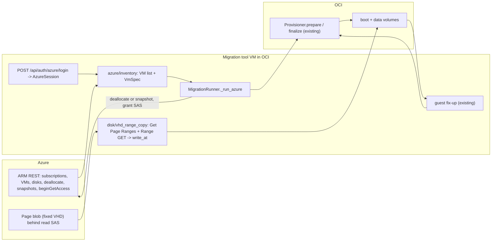

# Microsoft Azure as a second source platform

Date: 2026-09-18

## Goal

Migrate virtual machines from Microsoft Azure to OCI with the same tool that migrates VMs from
vCenter/ESXi today: log in to Azure, pick a VM, and the migration tool copies its managed disks
onto OCI volumes attached to itself, then hands them to a new OCI instance.

## Decisions

- **Capture mode per job.** Either *deallocate* the VM and export its disks (consistent copy,
  downtime during the copy), or *snapshot* the disks and export the snapshots while the VM keeps
  running (crash-consistent, snapshot storage cost). The export form asks, like today's power-off
  confirmation.
- **Authentication with a service principal.** Tenant ID, client ID and client secret are typed
  on an Azure login page and held in memory for the UI session. Nothing is persisted, like the
  vCenter credentials.
- **Data path: block copy onto attached volumes.** The Azure export SAS points at a page blob
  (fixed VHD). The tool lists the allocated page ranges and copies them with HTTP range requests
  straight onto the OCI volumes attached to the migration tool VM, through the existing
  `PositionalWriter` sink. `Provisioner.prepare` / `finalize` and the Linux guest fix-ups are
  reused unchanged.
- **Plain REST over `httpx`.** OAuth2 client credentials against Microsoft Entra ID and a small
  set of Azure Resource Manager and Blob endpoints. No `azure-*` SDK dependencies.

## Architecture

## Components

### `helper_app/azure/` (new package)

- `client.py`: `AzureClient` on `httpx`. Client-credentials token for
  `https://management.azure.com/.default` with automatic refresh; `get`/`post`/`delete` helpers
  that decode ARM errors into `AzureError` (`AzureAuthError` for `AADSTS*` failures and 401/403);
  long-running-operation polling through `Azure-AsyncOperation` / `Location`. Endpoints:
  list subscriptions, list VMs in a subscription, get VM with `$expand=instanceView`, list VM
  sizes per location, get disk, deallocate VM, create/get/delete snapshot,
  `beginGetAccess` / `endGetAccess` on disks and snapshots.
- `session.py`: `AzureSession` (tenant, client id, `AzureClient`, subscriptions, `close()`).
  Mirrors `VCenterSession` so `UserSession` can hold it.
- `inventory.py`: `list_vms(session)` -> `list[VmSummary]` over every readable subscription;
  `vm_spec_from_azure(vm, disks, sizes)` -> `VmSpec`:
  - `moid` = lower-cased Azure resource ID; `num_cpu` / `memory_mb` from the VM size catalog.
  - `firmware`: `hyperVGeneration` V1 -> BIOS, V2 -> EFI; `secure_boot`/`has_vtpm` from
    `securityProfile.uefiSettings`.
  - `guest_id` = `azure-windows` / `azure-linux`; `guest_full_name` from the image reference
    (publisher, offer, SKU) and the instance view OS name so `map_guest_os` recognises the family.
  - Disks: OS disk index 0, data disks by LUN; `capacity_bytes = diskSizeBytes`.
  - `power_state`: `PowerState/running` -> `poweredOn`, `deallocated`/`stopped` -> `poweredOff`,
    other states verbatim (refused by preflight).
  - `encrypted_disks`: disks with Azure Disk Encryption (`encryptionSettingsCollection.enabled`).
- `preflight.py`: refuses Confidential VMs, ADE-encrypted disks, `networkAccessPolicy = DenyAll`,
  ephemeral OS disks, VMs in transitional power states; warns on `AllowPrivate`, Secure Boot,
  odd vCPU counts, small disks.
- `export.py`: `AzureDiskExport` context manager. Deallocate mode: `beginGetAccess` on each
  disk. Snapshot mode: create an incremental snapshot per disk, then `beginGetAccess` on the
  snapshot. `close()` revokes every SAS and deletes the snapshots it created. `refresh(index)`
  re-grants a SAS that expired mid-copy.

### `helper_app/disk/vhd_range_copy.py` (new)

- `list_page_ranges(client, sas_url, blob_length)`: `GET ?comp=pagelist`, paginated with
  `marker`, returns sorted `(offset, length)` pairs clipped to the disk size (the 512-byte VHD
  footer at the end of the blob is excluded).
- `copy_ranges(client, sas_url, ranges, writer, chunk_bytes, workers, check_cancel, on_progress)`:
  range GETs (`x-ms-range`) in chunks of at most `chunk_bytes`, `writer.write_at(offset, data)`;
  a failed chunk is retried three times with backoff before the disk attempt fails. `workers`
  concurrent fetchers share the writer (pwrite is positional).
- Progress: `disk.stream_bytes` = sum of allocated ranges, so `percent` is exact;
  `bytes_written == bytes_received`.

### Sessions and auth

- `UserSession.azure: Optional[AzureSession]`; `anonymous` is true only without vCenter and
  Azure; `info()` carries `azure_tenant_id`, `azure_client_id`, `azure_subscriptions`.
- `require_azure_session` next to `require_vcenter_session`.
- `POST /api/auth/azure/login` (tenant_id, client_id, client_secret) validates the token, lists
  subscriptions and replaces the browser's session (like the vCenter login).

### Jobs

- `JobKind = Literal["vmware", "iso", "azure"]`; `Job.azure: Optional[AzureSourceInfo]`
  (tenant, subscription, resource group, capture mode, snapshots created, SAS expiry).
- `CreateAzureJobRequest(vm_id, target, capture_mode, power_off_source)`;
  `POST /api/jobs/azure` with the same validation as the VMware job.
- `GET /api/azure/vms` (30 s session cache) and `GET /api/azure/vms/{id}` -> `VmInspection`.
- `MigrationRunner.submit_azure` / `_run_azure`: `prepare` (unchanged) -> deallocate or snapshot
  -> `AzureDiskExport` -> per disk `_copy_azure_disk` (retry/progress/cancel like `_export_disk`)
  -> guest fix-up -> `finalize` (unchanged). Cleanup also revokes SAS and deletes snapshots.
- Instance tags: `oci-umt-source-azure = <subscription>/<resource group>`.
- Settings: `HELPER_AZURE_SAS_DURATION_S` (86400), `HELPER_AZURE_RANGE_WORKERS` (4),
  `HELPER_AZURE_RANGE_CHUNK_BYTES` (8 MiB), `HELPER_AZURE_DEALLOCATE_TIMEOUT_S` (900),
  `HELPER_AZURE_SNAPSHOT_TIMEOUT_S` (900).

### UI

- Start page card *Microsoft Azure*; Azure login form; nav entry *Azure VMs* (`data-azure-only`);
  Azure VM list; export form reusing the target form with a capture-mode choice instead of the
  power-off pop-up; job view rows for Azure jobs.

### Tests

- `tests/fake_azure.py`: token endpoint, ARM (subscriptions, VMs, disks, sizes, deallocate,
  snapshots, beginGetAccess/endGetAccess) and page blob (`comp=pagelist`, range GET) behind an
  `httpx.MockTransport`.
- Unit tests for inventory mapping, preflight, page range listing, range copy (sparse, footer,
  retry, cancel), export cleanup; end-to-end runner tests for both capture modes; API tests for
  login errors, VM list, job validation.

## Error handling

- `AADSTS*` and 401/403 -> clear login errors naming the missing RBAC action where possible.
- `beginGetAccess` failure -> job `FAILED` before any copy; cleanup revokes SAS / deletes snapshots.
- Range GET failure -> chunk retried, then the disk attempt fails and is retried from the start.
- SAS expiry mid-copy -> `refresh` re-grants and the copy continues.
- Deallocate / snapshot timeouts -> `ExportError` naming the VM or disk.

## Out of scope

Device-code user login, Confidential VMs, Azure Disk Encryption, ephemeral OS disks,
incremental sync, multiple NICs, Azure Stack, private-endpoint plumbing (documented only).
